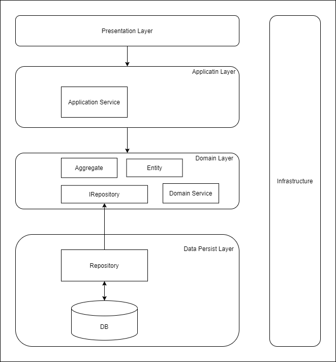

# Airelax

## 簡介

本專案為復刻知名租屋平台 Airbnb  
實作了包括:

- 房屋查詢
- 房屋上架
- 會員中心
- JWT 驗證
- 第三方登入(Line, Google, FB)
- 金流串接(綠界)
- Google map api 串接

等功能

## 使用技術與工具

- dotnet 5 web api -- 後端
- dotnet 5 MVC -- 前端
- vue.js -- 前端
- SQL server -- 資料庫
- entity framework -- ORM
- git -- 團隊協作
- docker -- 容器化
- gitHub 與 github action -- ci/cd
- confluence -- 專案文件 wiki
- jira -- 進度管理工具
- sonarcloud -- 程式碼分析工具

## 系統架構圖

